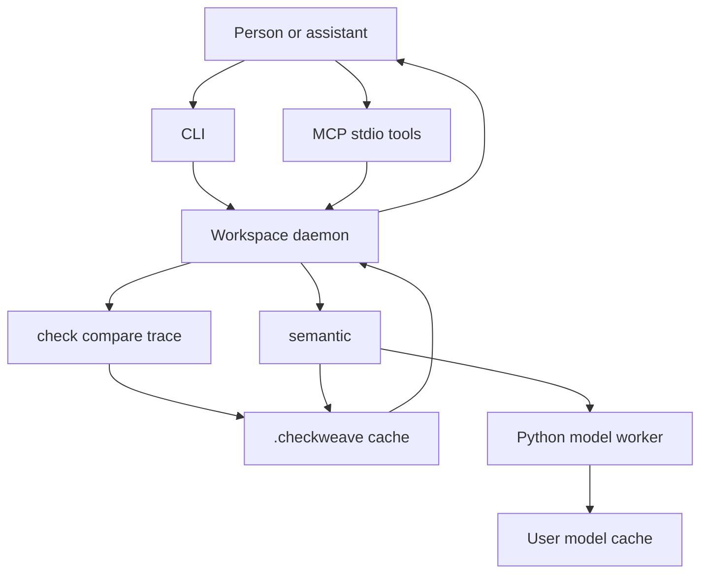

# Architecture

Checkweave is a local tool for behavior checks and execution evidence. A person or a coding assistant asks for one operation. A workspace daemon runs it and returns a compact JSON result plus handles to retained evidence.

It does not index arbitrary symbols, and it does not review a repository on its own. Deterministic operations need no model and no account.

## Boundaries

Execution, the workspace cache, and local inference stay on the machine. An explicitly configured hosted provider is outside that boundary: hosted Jev runs only when you select it. Workspace state lives in an ignored `.checkweave/` directory. Model weights live in the user cache. Setup uses the network when it has to install dependencies or download a model.

The assistant that called the tool may send the returned evidence to its own model provider. Local-first covers Checkweave's own execution, cache, and local inference. It leaves out an explicitly configured hosted provider, and it leaves out the assistant's own provider.

`compare` and `trace` run programs with ordinary local permissions. A Git worktree isolates source for one side of a comparison. It is not a sandbox. Inherited environment and other external state are untracked.

Semantic checks are optional. The default local profile is SemIf on pinned Qwen3.5-4B, CPU Q4. Hosted Jev is selected explicitly and is never a fallback when local inference fails. See [platforms](platforms.md) for which operating systems the release build covers. Model devices are not part of that matrix.

## How a request moves

The diagram is a workspace operation. `check`, `compare`, and `trace` do not start the model worker. `semantic` starts it when a request needs a decision. `init`, `deinit`, and `help` do not start the daemon. `init` writes workspace and editor files directly. `deinit` asks a daemon that is already running to exit, then removes the managed editor files, and it does not start one. `help` only prints usage.

Cursor does not need a separate daemon command. Its MCP entry runs `checkweave --workspace` with the absolute workspace root and the `mcp` subcommand. That process connects to the daemon or starts it.

## Source modules

| Module | Role |
| --- | --- |
| `src/main.rs` | CLI. Prints JSON results. |
| `src/mcp.rs` | MCP tools on stdio. Same daemon requests as the CLI. |
| `src/daemon.rs` | One worker per canonical worktree: lock, idle exit, Unix socket, watch, reconcile, run handles. |
| `src/workspace.rs` | Root discovery, `init` / `deinit`, Cursor MCP entry and managed rule. |
| `src/collection.rs` | JSON Lines checks and item cache. |
| `src/types.rs` | Shared requests, limits, predicates, coverage. |
| `src/sources.rs` | Membership, globs, and content fingerprints. |
| `src/compare.rs` | Before/after comparison, reduction, retained reproduction. |
| `src/execute.rs` | Run one argv with JSON on stdin and JSON on stdout. No shell. |
| `src/trace.rs` | Python trace capture and snapshot replay. |
| `src/semantic.rs` | Semantic collection check over text fields. |
| `src/models.rs` | Provider boundary: local SemIf, local GLiNER, optional Jev. |
| `python/checkweave_trace.py` | Embedded trace helper, materialized under the user cache. |
| `python/checkweave_worker/` | Embedded inference worker, materialized under the user cache. |

Supported platforms talk to the daemon over a Unix socket. Named-pipe code exists for native Windows; native Windows is not a release target ([platforms](platforms.md)).

## Lifecycle

`init` finds the workspace root. Inside a Git checkout that root is the worktree top. Linked worktrees do not share `.checkweave/` even when they share Git objects. Outside Git, the root is an existing Checkweave workspace or the directory you named. Init is idempotent. The default agent is Cursor: unrelated MCP servers stay, and Checkweave writes its own `mcpServers` entry and a managed `.cursor/rules/checkweave.mdc`. `init --agent none` skips those files. `deinit` removes the managed entry and the managed rule. It leaves the cache.

A workspace operation starts the daemon if it is not running. `init`, `deinit`, and `help` do not start it. One daemon serves that canonical root. Clients wait while the daemon holds its lock, and they respawn a daemon if nothing holds the lock. Protocol mismatch is rejected. Idle shutdown is internal. Ordinary use does not install a system service.

The daemon watches the worktree with native notifications when that works, and it falls back to polling when it does not. Startup reconciliation runs even when no event arrived. Watch events are hints. A query still identifies the bytes it read.

On Windows, use WSL and open the project from the WSL filesystem. Projects under `/mnt/c` are slow, and native change events there are unreliable, so the daemon polls.

## Data flow

**Check.** Globs select JSON Lines files. Each line is one JSON value: an object, array, or scalar. The predicate is explicit. The report lists coverage and a bounded set of rows, with path, line, and fingerprint. Evidence for the report id is retained until the cache drops it. A missing handle means the evidence is gone, not that the check passed.

**Compare.** You name two targets. Each target reads one JSON value from stdin and writes one JSON value to stdout. Inputs are supplied or generated. The report lists stable differences and keeps a reproduction. Reduction is optional and defaults to off; when it is on, it shrinks one stable difference inside the same budget. If a side is a committed revision, Checkweave reads Git and may use a temporary worktree. Commands run only for that request. Filesystem events do not launch them. Parser failures, crashes, timeouts, and truncated output are unsupported outcomes, not semantic differences.

**Trace.** You name a Python script. The helper records workspace call, line, return, and exception events and bounded scalar locals, with source lines. Nested imports follow the script. Native code and subprocesses are outside the trace.

**Semantic.** You name globs, a JSON Pointer to the text, and typed questions. Unchanged items can be reused when the question, settings, and input fingerprints match. The Rust daemon owns the request. The Python worker loads weights, batches compatible calls, and returns decisions. Provenance includes the model identity and settings. Unsupported questions and inputs that do not fit the declared limits stay visible.

**Replay.** `replay --kind compare` runs the current targets, or the named revisions, on the retained input. `outcome_reproduced` requires the fingerprints and outputs to match the retained run. `replay --kind trace` executes the retained snapshot. Editing the script afterward does not change that snapshot.

## Reuse and result meaning

In-flight deduplication applies to a deterministic collection check. Compare, trace, replay, semantic calls, and model setup are not folded together while they run.

Item reuse for `check` keys on the predicate and the record bytes. A second check of unchanged rows can be cache hits. Membership is part of the result: a new matching file changes the collection even though it was absent last time.

Semantic reuse additionally depends on the questions and the provider identity. A recorded model answer is an observation from that run. Replaying it is not a new prediction.

Keep these apart when you read a result:

| Dimension | What it means |
| --- | --- |
| Execution | Complete, partial, failed, or cancelled. Interrupted work is not published as complete. |
| Basis | Direct observation, deterministic derivation, or model judgment. |
| Scope | The files, revisions, and environment the operation actually used. |
| Coverage | Rows evaluated, matched, unmatched, skipped, unresolved, or a search budget. Coverage is not accuracy. |
| Freshness | Validated against the recorded inputs, stale, or unknown. The workspace can change after the response. |
| Evidence | Retained inputs, outputs, events, or a reproduction id. Expiry is reported. |

No difference from compare is not equivalence. A difference is not automatically a regression. Event order in a trace is not a cause.

## Operations

CLI output is JSON. MCP tool arguments for an operation are the operation's own fields. The check tool takes `include` and `predicate` directly, not a wrapped request object. The same pattern is used for the other operation-specific tools.

| CLI | MCP tool | What it returns |
| --- | --- | --- |
| `check` | `checkweave_check` | Predicate results for JSON Lines. |
| `evidence` | `checkweave_evidence` | Retained collection, trace, or semantic evidence. The MCP tool takes `id` only. |
| `status` | `checkweave_status` | Workspace and worker status. |
| `compare` | `checkweave_compare` | Differences and a reproduction. Reduction only when `reduce` is set; it defaults to off. |
| `replay` | `checkweave_replay` | Compare or trace replay. |
| `semantic` | `checkweave_semantic` | Model decisions for selected text. |
| `trace` | `checkweave_trace` | Python execution events. |
| `evidence --offset` / `--limit` | `checkweave_trace_page` | A later page of stored trace events. On MCP, pagination is this tool. `checkweave_evidence` takes `id` only. |
| `model setup` | `checkweave_model_setup` | Install or reuse the configured runtime. Does not by itself return a warm model. |
| `model evaluate` | `checkweave_model_evaluate` | One typed decision batch, outside a collection scan. |
| `run start` / `status` / `cancel` | `checkweave_run_start` / `checkweave_run_status` / `checkweave_run_cancel` | A handle for longer work, its snapshot, and cancellation. |
| `init`, `deinit`, `shutdown`, `mcp` | — | Setup, teardown, daemon stop, and the stdio server. `daemon` is a hidden entrypoint. |

`shutdown` asks the workspace worker to exit. Shared deterministic checks keep running for other clients when you cancel a run handle you own.

## Not in this tree

A general operator graph, a public plugin ABI, a custom workflow language, distributed execution, and a repository snapshot store are not implemented. Built-in operations are the ones in the table above. Extra language adapters and optional source-intelligence integrations are future work. They belong on the roadmap only after the current operations show a need ([roadmap](roadmap.md)).
