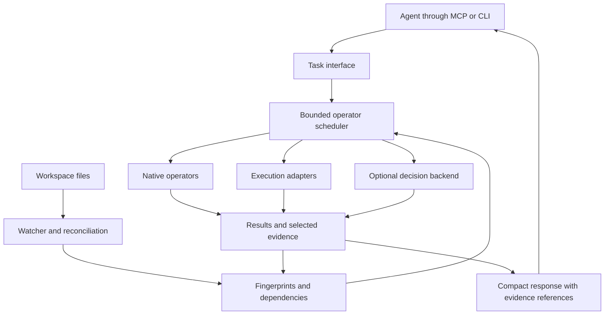

# Architecture

**Status:** proposed design; no runtime is implemented yet.

Checkweave is a local incremental evaluation engine for AI agents. The kernel owns
execution, input tracking, result reuse, and evidence retrieval. Adapters supply
specific capabilities such as collection reading, behavior comparison, runtime
capture, and semantic judgment.

## Product boundary

The user initializes a workspace once. The agent requests a task, receives a
compact result, and can follow references to supporting evidence. Checkweave
maintains its derived state automatically.

The runtime must earn its installation by reducing repeated agent work. A task
should produce something directly usable: a record to inspect, a differing input,
an observed value, or a finding that needs rechecking.

The first implementation will use Rust. Proposed components include SQLite for
local metadata, native filesystem notifications with reconciliation, and the
official Rust MCP SDK. Exact dependencies and versions will be selected during
implementation.

## Runtime structure

One shared worker serves each canonical working-tree root. Linked Git worktrees
have separate workspace state even when they share a Git object database. Multiple
agent clients should reuse that worker instead of duplicating watchers and work.

The MCP launcher starts or connects to the worker automatically. Local IPC uses a
Unix socket or Windows named pipe. The worker owns writes to SQLite; queries read
consistent published results. Startup, process locking, version negotiation,
crash recovery, and idle shutdown are internal lifecycle concerns.

No separately managed system service should be required for ordinary use.

## Lightweight workspace state

The working tree is authoritative for current files. Git is authoritative for
committed revisions. `.checkweave/` is a disposable cache with bounded retained
evidence, not a parallel repository history.

| Record | Minimum purpose |
| --- | --- |
| Source | Workspace-relative identity, size, modification metadata, content fingerprint, and last checked generation |
| Evaluation | Operator/version, parameters, input references, execution policy, status, and result |
| Dependency | The source or evaluation another evaluation actually depends on |
| Evidence | Selected inputs, outputs, or events needed to inspect or reproduce a result |

Source identity and content identity are distinct: two paths with the same bytes
can have different roles. A file fingerprint identifies observed bytes; it does
not retain them. When reproduction requires dirty or untracked input, preserve
the selected bytes under the evidence retention budget. Report when required
evidence has expired or was never captured.

Use Git objects for historical reads. Use temporary Git worktrees only when an
operation needs to execute a committed revision. Comparing a dirty working tree
requires an adapter to capture the relevant uncommitted state without changing
the user's work. Initial adapters should support narrowly defined inputs rather
than imply that arbitrary environments can be reconstructed.

## Composable operators

An operator consumes typed values or source references and returns a typed result
with dependency and evidence metadata. The initial vocabulary is a design sketch:

| Operator | Responsibility |
| --- | --- |
| `select` | Enumerate or narrow a declared input scope |
| `map` | Apply an operation independently to items |
| `judge` | Evaluate a typed predicate or rubric using a configured model |
| `execute` | Invoke a supported program or test adapter and capture observations |
| `compare` | Compare values or execution observations under explicit rules |
| `aggregate` | Combine results and compute exact counts or coverage |
| `search` | Explore candidates within a budget, optionally reducing a found case |

Operators declare their schema, implementation version, dependencies, execution
requirements, and reuse policy. Composition is an internal facility. The first
release should favor built-in implementations and task recipes; a public plugin
ABI or general workflow language needs separate justification.

Examples of compositions:

- **Collection check:** enumerate records, evaluate predicates, collect matches,
  and report skipped or unresolved records.
- **Behavior comparison:** generate inputs, execute both versions, compare
  observations, reduce a difference, and emit a reproduction.
- **Execution inspection:** capture events through an adapter, index the
  available relationships, and retrieve observations relevant to the request.
- **Revalidation:** inspect changed dependencies and rerun the required subgraph.

## Results preserve their meaning

Keep these dimensions separate:

| Dimension | Examples |
| --- | --- |
| Execution | Complete, partial, failed, cancelled |
| Basis | Direct observation, deterministic derivation, model judgment |
| Scope | Named records, declared input domain, revision, execution environment |
| Coverage | Items evaluated, skipped, failed, or unresolved; search budget used |
| Freshness | Validated against recorded inputs, stale, or unknown |
| Evidence | Original records, outputs, events, and reproduction references |

Evaluating every record establishes processing coverage, not classification
accuracy. A before/after difference establishes changed behavior; the intended
specification determines whether it is a regression. Finding no counterexample
within a budget does not establish equivalence. Event order alone does not
establish causation.

Return small summaries and stable handles to bounded details. Include original
source references where available. Missing observations and unsupported adapter
scope remain visible.

## Automatic updates

The normal path is:

1. Receive a filesystem event and mark the affected path dirty.
2. Coalesce a short burst of edits while respecting ignore rules.
3. Re-read event-marked inputs and confirm changes with fingerprints. Metadata
   checks can accelerate broader reconciliation; they are not content identity.
4. Refresh cheap derived state and invalidate dependent evaluations.
5. Recompute expensive results when a request needs them, within its budget.
6. Publish completed results together with the input generations they used.

New events arriving during evaluation remain pending. Before publication, check
whether relevant inputs changed; an obsolete result must not be presented as the
current result. A historical result may still be useful when its inputs are clear.

Watchers are hints. Reconcile on startup, after overflow or uncertain events, and
when a query needs freshness beyond what the watcher can establish. Use bounded
polling where native notifications are unreliable. Handle adds, deletes, renames,
atomic editor saves, directory changes, ignore-rule changes, and Git checkouts.

Collection membership is itself a dependency. A newly added matching file must
invalidate a collection result even though that file was absent from the previous
evaluation's dependency list.

A query should identify the state it validated, not claim that the workspace
cannot change after the response. Adapters that cannot capture a coherent input
set must disclose that limitation.

## Scheduling and reuse

- Bound CPU work, subprocesses, memory, model requests, output size, and retained
  evidence. Keep expensive work away from the protocol's responsive I/O path.
- Deduplicate equivalent in-flight work where reuse is valid.
- Make cancellation and partial progress explicit. Interrupted work must not
  publish as a completed evaluation.
- Include operator version, parameters, input fingerprints, and relevant
  configuration/environment dependencies in reuse decisions.
- Treat stochastic, effectful, and externally dependent operators according to
  their declared policies. A recorded model response is an observation from a
  specific run; replaying it is different from making a new prediction.
- Track dependency completeness. Untracked environment or external state limits
  freshness claims and can require fresh execution.

Use file-level dependency tracking initially. Finer granularity should follow
measurements showing that its extra bookkeeping reduces useful work.

Workspace changes automatically trigger bookkeeping and inexpensive analysis.
They do not implicitly authorize repeated external actions or unlimited execution.
Worktrees isolate source changes; they are not a security sandbox for executed
programs. Execution adapters must state their containment and side-effect model.

## Model backend boundary

Typed decision models can evaluate records, rank candidates, or help select
relevant observations. Exact comparisons, dependency maintenance, counting, and
coverage accounting remain native operations.

Batch model work inside the runtime so the agent need not make one MCP call per
item. Record backend/model identity, question schema, relevant settings, and
truncation or chunking decisions with results.

The default deterministic path should require no account or model download. A
local semantic backend must be validated for accuracy, latency, memory, context
limits, and packaging. Laya-MLX is inspiration, not a selected Rust dependency;
Python-free native inference remains an open implementation choice.

## Agent ergonomics

The target setup command is `checkweave init`. It should be idempotent, discover
the workspace, create local state, and configure the selected supported agent
integration without replacing unrelated settings. Use a short, managed instruction
block with concrete triggers for using the tools.

Expose a small set of task-oriented operations. Tool names and schemas remain
open until the first useful operation is implemented and evaluated. The CLI and
MCP should use the same underlying request and response types.

For longer work, return a run handle with progress and cancellation. Keep useful
results near the front of the response, offer bounded expansion, and explain
incomplete work with a concrete next step. Routine cache and worker lifecycle
details should stay out of the ordinary interaction.

## Open decisions

- The first agent integration and supported release platforms.
- The smallest useful collection and execution adapters.
- The native semantic inference backend and checkpoint.
- Default resource budgets, evidence retention, and polling policy.
- How much automatic language or test-runner discovery earns its complexity.
- Whether optional CodeGraph integration improves source selection enough to
  justify an additional adapter.

Resolve these with runnable examples and measurements. The project should remain
useful with a small set of well-supported operations.
